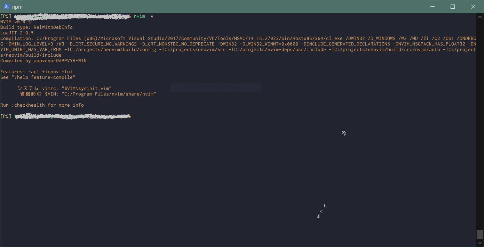
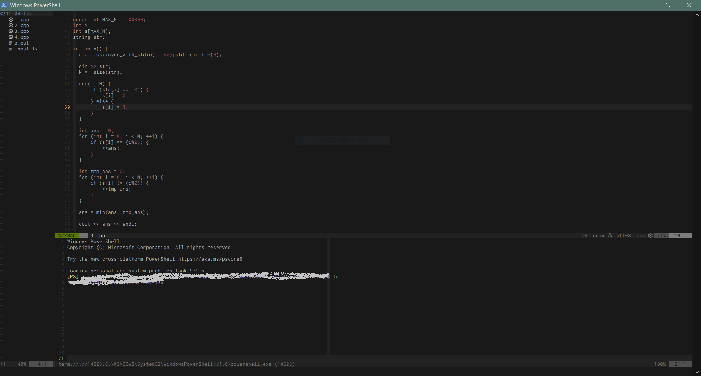

## これは何

当ブログ運営者が初めて自分のパソコンを所持したのは、ちょうど3年前、大学一年の冬の時です。  
姉から譲り受けた、東芝dynabook KIRAの2013年冬モデルでした。

windowsとlinuxのデュアルブートにしたくて試行錯誤した挙句、早々にWindowsOSを消し去ってしまい、その後は仕方なくubuntuマシンとして愛用し続けて来たのですが、先日ついにバッテリーがいかれ、電源アダプターに繋いでいないと2分と持たず電源が切れてしまうようになったので、新しくノートPCを購入することにしました。

メモリ16GB、ストレージ500GB前後の条件で探したところ、一番コスパの良かったHP Spectre x360を購入。  
OSはアルバイトの関係上linuxを導入するのはやめてwindowsに乗り換えることにしました。

さて、linuxからwindowsに乗り換えた者に、最初に立ちはだかる壁がcmdやpowershellの使いづらさだと思います。  
少なくとも当ブログ運営者はそう感じました。  
特にストレスだったのが、デフォルトではファイルをcmdやpowershell上で開く機能がない点です。(ちゃんと探せばあるのかもしれませんが...)

何とかcmd内でファイルを開けるようにしたいとの思いで、ググりまくったところneovimがwindowsでも使えるとの情報に遭遇。  
結果windowsでもlinuxのterminalと同じようにnvimでファイルを編集できるようになりました。

今回は、windowsにneovimをインストールする方法と、プラグインをdeinで管理できるようにする方法、最後にvim-deviconsを導入してneovimの見た目をリッチにする方法をまとめたいと思います。

## neovimをインストール

今回はchocolatolyという、パッケージ管理ツールを使ってneovimをインストールしたいと思います。

chocolatelyはubuntuでいうところのaptみたいなものです。

管理者権限のpowershell上で、以下のように利用します。

```shell
// packageのインストール。 sudo apt install <package>みたいな感じ。
PS> choco install <package>

// packageのアップデート。 sudo apt update / sudo apt upgradeみたいな感じ。
PS> choco upgrade all
```

neovimのインストールも同様に、管理者権限のpowershellからコマンド一発で出来ます。

```shell
// NOTE: 管理者権限のpowershellで実行すること。
PS> choco install neovim
```

nvimとコマンドを実行してパスが通っているかどうか確認しておきます。  
正しくインストール出来ていれば下画像のような結果になります。



## python、ruby、nodejsのneovimモジュールをインストール

neovimからpython、ruby、nodejsのプラグインを呼び出せるようにそれぞれneovimモジュールをインストールします。

python、ruby、nodejs自体のインストールがまだの場合は、あらかじめインストールしておいてください。

```shell
// phython2のneovimモジュールをインストール
PS> pip2 install neovim

// phython3のneovimモジュールをインストール
PS> pip3 install neovim

// rubyのneovimモジュールをインストール
PS> gem install neovim

// nodejsのneovimモジュールをインストール
PS> npm install -g neovim
```

それぞれ正しくインストール出来ているかチェックするために、nvimを開いて:checkhealthコマンドを実行してみてください。  

## dein.vimを導入

次にneovimでプラグイン管理を簡単にしてくれるdeinを導入します。

まず~/.cacheフォルダを作成し、その中でgithubからdein.vimをclone。

```shell
PS> cd ~
PS> mkdir .cache
PS> cd .cache
PS> git clone git@github.com:Shougo/dein.vim.git 
```

init.vimファイルを~/AppData/Local/nvimフォルダ内に作成し、以下を書き込む。

```vim:title=init.vim
"dein Scripts-----------------------------
if &compatible
  set nocompatible               " Be iMproved
endif

" Required:
set runtimepath+=C:\Users\user\.cache\dein.vim

" Required:
if dein#load_state('C:\Users\user\.cache\dein.vim')
  call dein#begin('C:\Users\user\.cache\dein.vim')

  " Let dein manage dein
  " Required:
  call dein#add('C:\Users\user\.cache\dein.vim')

  " Add or remove your plugins here like this:
  call dein#add('Shougo/neosnippet.vim')
  call dein#add('Shougo/neosnippet-snippets')

  " Required:
  call dein#end()
  call dein#save_state()
endif

" Required:
filetype plugin indent on
syntax enable

" If you want to install not installed plugins on startup.
"if dein#check_install()
"  call dein#install()
"endif

"End dein Scripts-------------------------
```

neovimを開いて、:call dein#install()コマンドを実行。

あとは好きなプラグインをどんどん追加していくだけ。

一応、参考までに、当ブログ運営者のinit.vimも記載しておきます。

```vim:title=init.vim
" neovim settings

" The following are commented out as they cause vim to behave a lot
" differently from regular Vi. They are highly recommended though.
set showcmd        " Show (partial) command in status line.
set showmatch        " Show matching brackets.
set ignorecase        " Do case insensitive matching
set smartcase        " Do smart case matching
set incsearch        " Incremental search
set autowrite        " Automatically save before commands like :next and :make
set hidden        " Hide buffers when they are abandoned
" set mouse=a        " Enable mouse usage (all modes)

set encoding=utf-8
scriptencoding utf-8

set showcmd               " 入力中のコマンドをステータスに表示
set number                " 行番号を表示
set cursorline            " 現在の行を強調表示
set cursorcolumn          " 現在の行を強調表示
set smartindent           " インデントはスマートインデント
set expandtab             " Tab文字を半角スペースにする
set tabstop=2             " Tab幅を設定する
set shiftwidth=2          " vimが自動で生成するTab幅を設定する
set wrapscan              " 検索時に最後まで行ったら最初に戻る
set hlsearch              " 検索語をハイライト表示
set virtualedit=all       " 文字のないところまでカーソル移動ができるようになる
set autoindent            " オートインデントをオンにする
nnoremap <Esc><Esc> :nohlsearch<CR><Esc>
                    " ESC連打でハイライト解除

" ZZとZQを無効化する
nnoremap ZZ <Nop>
nnoremap ZQ <Nop>

" <CR>で空行が入力できるようにする
nnoremap <CR> o<Esc>

" スペースで空文字が入力できるようにする。
nnoremap <Space> i<Space><Esc>

" カーソル移動のjkを見た目上の一行移動にする
nnoremap j gj
nnoremap k gk

" カーソル移動を高速化する
nnoremap fj 10j
nnoremap fk 10k
nnoremap fh 10h
nnoremap fl 10l

" ファイルフォーマットを指定
set fileformats=unix,mac,dos

" shellをpowershellに設定
set shell=powershell.exe

" レイアウトを設定する
command! Layout call Layout_func()
function! Layout_func() abort
  split
  exe "normal \<c-w>j"
  for i in range(15)
    exe "normal \<c-w>-"
  endfor
  terminal
  silent NERDTree
  for i in range(13)
    exe "normal \<c-w><"
  endfor
  exe "normal \<c-w>l"
endfunction

"dein Scripts-----------------------------
if &compatible
  set nocompatible               " Be iMproved
endif

" Required:
set runtimepath+=C:\Users\user\.cache\dein.vim

" Required:
if dein#load_state('C:\Users\user\.cache\dein.vim')
  call dein#begin('C:\Users\user\.cache\dein.vim')

  " Let dein manage dein
  " Required:
  call dein#add('C:\Users\user\.cache\dein.vim')

  " Add or remove your plugins here like this:
  call dein#add('Shougo/neosnippet.vim')
  call dein#add('Shougo/neosnippet-snippets')
  call dein#add('Shougo/unite.vim')
  call dein#add('Shougo/denite.nvim')
  call dein#add('Shougo/vimfiler.vim')
  call dein#add('Shougo/deoplete.nvim')
  call dein#add('w0ng/vim-hybrid')
  call dein#add('simeji/winresizer')
  call dein#add('cohama/lexima.vim')
  call dein#add('scrooloose/nerdtree')
  call dein#add('ryanoasis/vim-devicons')
  call dein#add('itchyny/lightline.vim')
  call dein#add('delphinus/lightline-delphinus')
  call dein#add('w0rp/ale')
  call dein#add('Yggdroot/indentLine')
  call dein#add('gregsexton/MatchTag')


  " Required:
  call dein#end()
  call dein#save_state()
endif
" Required:
filetype plugin indent on
syntax enable
" If you want to install not installed plugins on startup.
  "if dein#check_install()
  "  call dein#install()
  "endif
"End dein Scripts-------------------------


"neosnippet-------------------------------------------------------------------------------
" plugin key-mappings.
imap <C-k>  <Plug>(neosnippet_expand_or_jump)
smap <C-k>  <Plug>(neosnippet_expand_or_jump)
xmap <C-k>  <Plug>(neosnippet_expand_target)

" SuperTab like snippet behavior
imap <C-k>  <Plug>(neosnippet_expand_or_jump)
smap <expr><Tab> neosnippet#expandable_or_jumpable() ? "\<Plug>(neosnippet_expand_or_jump)" : "\<Tab>"

" For conceal markers.
if has('conceal')
  set conceallevel=2 concealcursor=niv                 
endif
"end--------------------------------------------------------------------------------------

"deoplete.nvim----------------------------------------------------------------------------

" Use deoplete Default: 0
" let g:deoplete#enable_at_startup = 1

" Enable deoplete when InsertEnter.
let g:deoplete#enable_at_startup = 0
autocmd InsertEnter * call deoplete#enable()

" The number of input starting completion Default: 2
let g:deoplete#auto_complete_start_length=1

"end--------------------------------------------------------------------------------------

"vim-hybrid-------------------------------------------------------------------------------

set background=dark
colorscheme hybrid

"end--------------------------------------------------------------------------------------


"nerdtree---------------------------------------------------------------------------------

nnoremap <C-t> :NERDTreeToggle<CR>
autocmd bufenter * if (winnr("$") == 1 && exists("b:NERDTree") && b:NERDTree.isTabTree()) |q| endif

"end--------------------------------------------------------------------------------------

"lightline.vim ---------------------------------------------------------------------------

set laststatus=2    "ウィンドウの末尾から二行目にステータスラインを常時表示

"end--------------------------------------------------------------------------------------

"ale--------------------------------------------------------------------------------------

" Enable completion where available.
let g:ale_completion_enabled = 1

" Keep the sign gutter open
let g:ale_sign_column_always = 1

" change cpp version
" let g:ale_cpp_clang_options = '-std=c++14 ' 

" navigate between errors
nmap <silent> <C-k> <Plug>(ale_previous_wrap)
nmap <silent> <C-j> <Plug>(ale_next_wrap)

" enable lint when file is saved and when text is changed
let g:ale_lint_on_text_changed = 1
let g:ale_fix_on_save = 1

" enable cpp linter
autocmd BufRead,BufNewFile *.cpp let g:ale_linters = { 'cpp' : ['gcc'] }
autocmd BufRead,BufNewFile *.h let g:ale_linters = { 'cpp' : ['gcc'] }

" enable python linter
autocmd BufRead,BufNewFile *.py let g:ale_fixers = { 'python' : ['autopep8'] }
autocmd BufRead,BufNewFile *.py let g:ale_linters = { 'python' : ['pylint'], }

" enable latex linter
autocmd BufRead,BufNewFile *.tex let g:ale_fixers = { 'latex' : ['lacheck'] }

" enable javascript linter
autocmd BufRead,BufNewFile *.js let g:ale_linters = { 'javascript' : ['eslint'], }

" disable cs linter
autocmd BufRead,BufNewFile *.cs let g:ale_linters = { 'cs' : [''], }

"end--------------------------------------------------------------------------------------

"indentLine-------------------------------------------------------------------------------

let g:indentLine_enabled = 0
autocmd BufRead,BufNewFile *.html let g:indentLine_enabled = 1

"end--------------------------------------------------------------------------------------
```

## vim-deviconsを使えるようにする

neovimのステータスバーやNERDTreeの見た目をリッチにしてくれるvim-deviconsプラグイン。  
インストールするのに少し躓いたのでまとめておきます。  
なお、今回の方法ではcmdやpowershell全体のフォントが変更されてしまうので、あらかじめご了承ください。

まずgithubからnerd-fontをcloneします。

```shell
PS> git clone --depth 1 git@github.com:ryanoasis/nerd-fonts.git
```

結構時間がかかるので気長に待ちます。

次にfontにパッチを当ててることができるfontforgeなるものをインストールします。

```shell
// 管理者権限のpowershellで実行
PS> choco install fontforge
```

好きなfontにパッチを当てます。  
今回はRictyDiminishedというフォントにパッチを当てることにしました。

RichtyDiminishedは[ここから](https://github.com/mzyy94/RictyDiminished-for-Powerline)ダウンロード出来ます。  
ダウンロードした.ttfファイルをnerd-fontsのルートディレクトリに移動、以下のコマンドを実行します。


```shell
PS> cd nerd-fonts
PS> fontforge ./font-patcher RictyDiminished-Regular.ttf --windows --complete
PS> fontforge ./font-patcher RictyDiminished-Bold.ttf --windows --complete
PS> fontforge ./font-patcher RictyDiminished-Oblique.ttf --windows --complete
PS> fontforge ./font-patcher RictyDiminished-BoldOblique.ttf --windows --complete
```

無事に処理が完了すれば、以下のフォントが新しく作成されているはずです。

|file name|
|---|
|Ricty Diminished Regular Nerd Font Complete Windows Compatible.ttf|
|Ricty Diminished Bold Nerd Font Complete Windows Compatible.ttf|
|Ricty Diminished Oblique Nerd Font Complete Windows Compatible.ttf|
|Ricty Diminished Bold Oblique Nerd Font Complete Windows Compatible.ttf|

パッチを当てたフォントをシステムに登録します。
登録方法は、作成した.ttfファイル全てを、設定->ホーム->フォントにドラッグアンドドロップするだけです。

最後にpoweshellを起動し、左上アイコンからプロパティを開き、新しく登録したfontを選択します。  
RitchyDiminished NFと表示されているかと思います。

これでneovimにvim-deviconsを導入できます。

最終的な見た目は下画像の通りです。



## まとめ

以上、長い道のりでしたが、windowsへneovimをインストールすることができました。  
今後もlinuxユーザーがwindowsに乗り換えた際に躓きそうな点などを記事にしていきたいと思います。  
最後まで読んでいただきありがとうございました。


## 参考リンク

- [Ricty DiminishedとNerd Fontsを合成する方法(Mac) - Qiita](https://qiita.com/uhooi/items/dc9a9657f1706283753b)