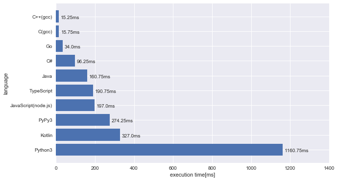
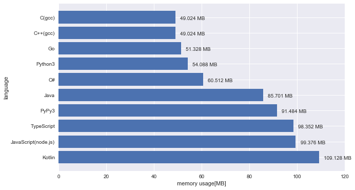

## これは何

二週間ほど前からPythonの勉強を始めたのですが、AtCoderの問題をPyhtonで解いた時に、今までC++だと普通に通っていたアルゴリズムが実行時間制限により通らなくなるという事態に遭遇しました。  
他の言語の実行時間も気になったので、自分が触ったことのある色々な言語で同じアルゴリズムを実装し、実行時間とメモリ使用量を比較してみます。

## 比較対象の言語と検証に用いた問題

比較対象の言語は、C、C++、C#、Java、Go、Python、PyPy、Kotlin、JavaScirpt(node.js)、TypeScriptです。  
検証には以下の問題を用いました。

- [C - 高橋君とカード](https://atcoder.jp/contests/arc060/tasks/arc060_a)

以下にACしたソースコードを載せてありますので、ネタバレされたくない方は問題を解いた後、続きを読んで頂ければ幸いです。

## 免責事項

ほとんどの言語について入門書を一冊読んだ程度の知識しかありません。  
また、この検証は言語の性能?を厳密に比較したものではありません。  
特定の言語について別の書き方をすれば実行時間が短くなることもあると思います。

あくまで、この言語のこのソースコードをAtCoderに提出したらこれくらいの実行時間がかかったよ、ほげーという低レベルな比較です。


## コード

以下、ソースコードを記載します。
結果は[こちら](https://www.takigawa-memo.com/compare-language-atcoder/#結果)からまとめています。

### C

```c:title=main.c
#include <stdio.h>

#define _overload(a, b, c, d, ...) d
#define _rep1(X, A, Y) for (int X = (A); X <= (Y);++X)
#define _rep2(X, Y) for (int X = 0; X < (Y); ++X)
#define rep(...) _overload(__VA_ARGS__, _rep1, _rep2)(__VA_ARGS__)
typedef long long ll;

#define MAX_N 50
#define MAX_A 50
int N, A;
int x[MAX_N + 1];
ll dp[MAX_N + 1][MAX_N + 1][MAX_N * MAX_A + 1];

int main() {
    scanf("%d %d", &N, &A);
    rep(i, 1, N) scanf("%d", &x[i]);

    rep(i, N) dp[i][0][0] = 1;

    rep(i, 1, N) {
        rep(j, 1, i) {
            rep(k, 1, N * A) {
                if (k < x[i]) {
                    dp[i][j][k] = dp[i - 1][j][k];
                } else {
                    dp[i][j][k] = dp[i - 1][j][k] + dp[i - 1][j - 1][k - x[i]];
                }
            }
        }
    }

    ll ans = 0;
    rep(j, 1, N) {
        ans += dp[N][j][j * A];
    }

    printf("%lld\n", ans);

    return 0;
}
```

### C++

Cとほとんど同じ。

```cpp:title=main.cpp
#include <iostream>

#define _overload(a, b, c, d, ...) d
#define _rep1(X, A, Y) for (int X = (A); X <= (Y);++X)
#define _rep2(X, Y) for (int X = 0; X < (Y); ++X)
#define rep(...) _overload(__VA_ARGS__, _rep1, _rep2)(__VA_ARGS__)
using namespace std;
typedef long long ll;

const int MAX_N = 50, MAX_A = 50;
int N, A;
int x[MAX_N + 1];
ll dp[MAX_N + 1][MAX_N + 1][MAX_N * MAX_A + 1];

int main() {
    cin >> N >> A;
    rep(i, 1, N) cin >> x[i];

    rep(i, N) dp[i][0][0] = 1;

    rep(i, 1, N) {
        rep(j, 1, i) {
            rep(k, 1, N * A) {
                if (k < x[i]) {
                    dp[i][j][k] = dp[i - 1][j][k];
                } else {
                    dp[i][j][k] = dp[i - 1][j][k] + dp[i - 1][j - 1][k - x[i]];
                }
            }
        }
    }

    ll ans = 0;
    rep(j, 1, N) {
        ans += dp[N][j][j * A];
    }

    cout << ans << endl;

    return 0;
}
```

### CS

```cs:title=Main.cs
using System;
using System.Linq;
using System.Collections.Generic;
class Program {
    static void Main(string[] args) {
        int[] input = Console.ReadLine().Split(' ').Select(int.Parse).ToArray();
        int N = input[0];
        int A = input[1];

        int[] x = new int[N + 1];
        input = Console.ReadLine().Split(' ').Select(int.Parse).ToArray();
        for (int i = 0; i < N; ++i) {
            x[i + 1] = input[i];
        }

        long[,,] dp = new long[N + 1, N + 1, N * A + 1];

        for (int i = 0; i < N; ++i) dp[i, 0, 0] = 1;

        for (int i = 1; i <= N; ++i) {
            for (int j = 1; j <= i; ++j) {
                for (int k = 1; k <= N * A; ++k) {
                    if (k < x[i]) {
                        dp[i, j, k] = dp[i - 1, j, k];
                    } else {
                        dp[i, j, k] = dp[i - 1, j, k] + dp[i - 1, j - 1, k - x[i]];
                    }
                }
            }
        }

        long ans = 0;
        for (int j = 1; j <= N; ++j) {
            ans += dp[N, j, j * A];
        }

        Console.WriteLine(ans);
    }
}
```

### Java

```java:title=Main.java
import java.util.*;

public class Main {
    public static void main(String[] args) {
        Scanner sc = new Scanner(System.in);

        int N = sc.nextInt();
        int A = sc.nextInt();
        int[] x = new int[N + 1];
        for (int i = 1; i <= N; ++i) {
            x[i] = sc.nextInt();
        }

        long[][][] dp = new long[N + 1][N + 1][N * A + 1];
        for (int i = 0; i < N; ++i) {
            dp[i][0][0] = 1;
        }

        for (int i = 1; i <= N; ++i) {
            for (int j = 1; j <= i; ++j) {
                for (int k = 1; k <= N * A; ++k) {
                    if (k < x[i]) {
                        dp[i][j][k] = dp[i - 1][j][k];
                    } else {
                        dp[i][j][k] = dp[i - 1][j][k] + dp[i - 1][j - 1][k - x[i]];
                    }
                }
            }
        }

        long ans = 0;
        for (int j = 1; j <= N; ++j) {
            ans += dp[N][j][j * A];
        }

        System.out.println(ans);
    }
}
```

### Go

```go:title=main.go
package main

import "fmt"

const (
    MAX_N = 50
    MAX_A = 50
)

func main() {
    var N, A int
    var x [MAX_N + 1]int

    var dp [MAX_N + 1][MAX_N + 1][MAX_N*MAX_A + 1]int64

    fmt.Scanf("%d %d", &N, &A)
    for i := 0; i < N; i++ {
        fmt.Scanf("%d", &x[i+1])
    }

    for i := 0; i < N; i++ {
        dp[i][0][0] = 1
    }

    for i := 1; i <= N; i++ {
        for j := 1; j <= i; j++ {
            for k := 1; k <= A*N; k++ {
                if k < x[i] {
                    dp[i][j][k] = dp[i-1][j][k]
                } else {
                    dp[i][j][k] = dp[i-1][j][k] + dp[i-1][j-1][k-x[i]]
                }
            }
        }
    }

    ans := int64(0)
    for j := 1; j <= N; j++ {
        ans += dp[N][j][j*A]
    }

    fmt.Printf("%d\n", ans)
}
```

### Python3

```python:title=main.py
def main():
    N, A = map(int, input().split())
    x = [0]
    x.extend(list(map(int, input().split())))

    dp = [[[0] * (N * A + 1) for _ in range(N + 1)] for _ in range(N + 1)]
    for i in range(N + 1):
        dp[i][0][0] = 1

    for i in range(1, N + 1):
        for j in range(1, i + 1):
            for k in range(1, N * A + 1):
                if k < x[i]:
                    dp[i][j][k] = dp[i - 1][j][k]
                else:
                    dp[i][j][k] = dp[i - 1][j][k] + dp[i - 1][j - 1][k - x[i]]

    ans = 0
    for j in range(1, N + 1):
        ans += dp[N][j][A * j]

    print(ans)


if __name__ == '__main__':
    main()
```

### PyPy3

Python3と同じ。

### Kotlin

```kotlin:title=Main.kt
var N = 0
var A = 0

fun main(args: Array<String>) {
    readLine()?.split(" ")?.map {
        it.toInt()
    }?.let {
        N = it[0]
        A = it[1]
    }


    val x = IntArray(N + 1)
    readLine()?.split(" ")?.map {
        it.toInt()
    }?.forEachIndexed { i, n ->
        x[i + 1] = n
    }

    val dp = Array(N + 1) {
        Array(N + 1) {
            LongArray(N * A + 1)
        }
    }
    for (i in 0..N) {
        dp[i][0][0] = 1
    }

    for (i in 1..N) {
        for (j in 1..i) {
            for (k in 1..(N * A)) {
                dp[i][j][k] = if (k < x[i]) {
                    dp[i - 1][j][k]
                } else {
                    dp[i - 1][j][k] + dp[i - 1][j - 1][k - x[i]]
                }
            }
        }
    }

    var ans = 0L
    for (j in 1..N) {
        ans += dp[N][j][j * A]
    }

    println(ans)
}
```

### JavaScript

```javascript:title=main.js
function main(input) {
  input = input.split('\n');
  var tmp = input[0].split(' ');

  var N = Number(tmp[0]);
  var A = Number(tmp[1]);

  var x = [0];
  x = x.concat(input[1].split(' ').map(Number));

  var dp = new Array(N + 1);
  for (var i = 0; i <= N; ++i) {
    dp[i] = new Array(N + 1);
    for (var j = 0; j <= N; ++j) {
      dp[i][j] = new Array(A * N + 1).fill(0);
    }
  }

  for (var i = 0; i < N; ++i) dp[i][0][0] = 1;

  for (var i = 1; i <= N; ++i) {
    for (var j = 1; j <= i; ++j) {
      for (var k = 1; k <= A * N; ++k) {
        if (k < x[i]) {
          dp[i][j][k] = dp[i - 1][j][k];
        } else {
          dp[i][j][k] = dp[i - 1][j][k] + dp[i - 1][j - 1][k - x[i]];
        }
      }
    }
  }

  var ans = 0;
  for (var j = 1; j <= N; ++j) {
    ans += dp[N][j][j * A];
  }

  console.log(ans);
}

main(require('fs').readFileSync('/dev/stdin', 'utf8'));
```

### TypeScript

JavaScriptとほとんど同じ。

```typescript:title=main.ts
import * as fs from 'fs';

function main(input: string) {
  let lines = input.split('\n');
  let tmp = lines[0].split(' ');

  let N = Number(tmp[0]);
  let A = Number(tmp[1]);

  let x = [0];
  x = x.concat(lines[1].split(' ').map(Number));

  let dp = new Array(N + 1);
  for (let i = 0; i <= N; ++i) {
    dp[i] = new Array(N + 1);
    for (let j = 0; j <= N; ++j) {
      dp[i][j] = new Array(A * N + 1).fill(0);
    }
  }

  for (let i = 0; i < N; ++i) dp[i][0][0] = 1;

  for (let i = 1; i <= N; ++i) {
    for (let j = 1; j <= i; ++j) {
      for (let k = 1; k <= A * N; ++k) {
        if (k < x[i]) {
          dp[i][j][k] = dp[i - 1][j][k];
        } else {
          dp[i][j][k] = dp[i - 1][j][k] + dp[i - 1][j - 1][k - x[i]];
        }
      }
    }
  }

  let ans = 0;
  for (let j = 1; j <= N; ++j) {
    ans += dp[N][j][j * A];
  }

  console.log(ans);
}

main(fs.readFileSync('/dev/stdin', 'utf8'));
```

## 結果

各言語についてAtCoderのジャッジシステムに4回提出し、実行時間とメモリ使用量の平均をまとめました。

- 実行時間



- メモリ使用量



## まとめ

書き方の問題もあるかもしれませんが、イメージしていたよりもKotlinの結果が良くなかったです。  
また、同じインタプリタ言語のランタイムでも、PyPyやnode.js(TypeScript, JavaScript)のメモリ使用量がPythonに比べて多い理由が気になりますね。  
JITコンパイラであることと関係があるのでしょうか。  

今回はループ処理と配列操作が実行時間を決める主な要因でしたので、機会があれば再帰関数を使うような問題に対しても同様な検証をしてみたいと思います。

