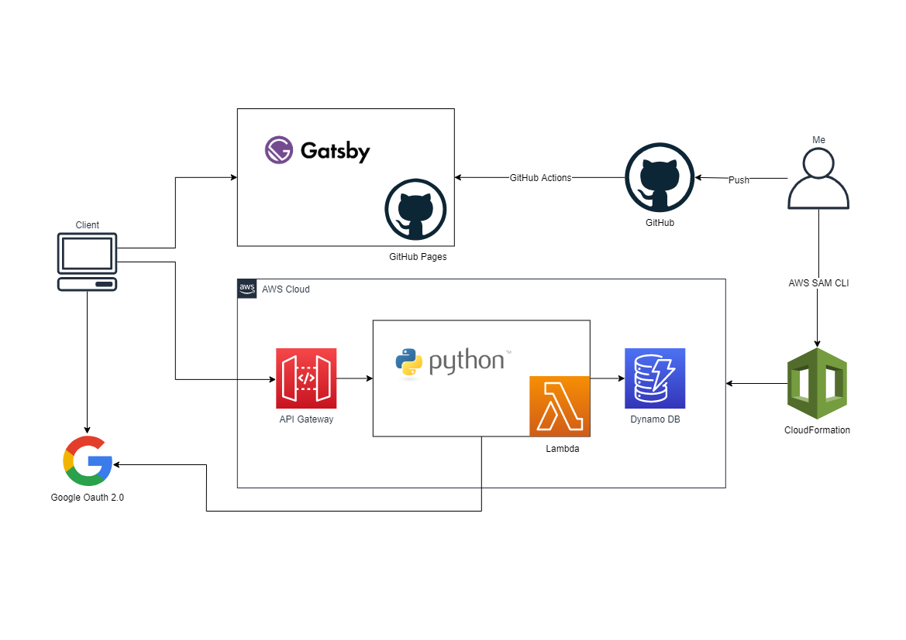

## これは何

先日[自分のブログ](https://www.takigawa-memo.com)にコメント機能を実装しました。

フロントエンドはGatsby.jsで作成し、GitHubPages上にデプロイしてます。  
バックエンドはAWS上にAPI Gateway、Lambda(python)、Dynamo DBというサーバーレスな構成で作成しました。  
認証はGoogleアカウントを用いたOauth認証を利用しています。

はじめはバックエンドを、ろくに料金体系を調べもせずに、Spring Boot + Kotlinで作成しGKE上にデプロイしてみたのですが、
可用性を全く考慮せずに最安値で構成しても毎日おおよそ900円程度のコストがかかってしまうことが判明したので急いでやめました。

今回は改めてサーバレスな構成でコメント機能を実装するにあたり、
主にバッグエンド側の実装で個人的に躓いた点をまとめていきたいと思います。

## 初めに

ブログのようなWebサイトにコメント欄を設置する場合、自分で実装するのではなく、Disqusなどのサービスを利用するケースが多いようです。   
ユーザー認証やsession管理についても、自分で実装するのではなく、
CognitoやFirebase Authenticationのような仕組みとSDKを用いた方が簡単でセキュリティ的にも安心です。

今回コメント投稿機能を実装した理由は、Oauthによる認証の流れやsession管理
についてより深く理解するためのHands On的な意味合いが大きいので、あらかじめご了承ください。

また、普段自分は主にAndroidアプリを開発しており、Webフロントエンドやバックエンドについては鬼素人ですので、何か不備がありましたら指摘していただけると幸いです。
<- (コメント投稿機能を利用して!)

## 仕様

実現したかった機能は以下の通りです。

- 記事に対してコメントを投稿できる。
- 自分が投稿したコメントは削除できる。
- コメントを投稿するには、Googleアカウントによるログインが必要。
- ログインに成功したら、一意なユーザーidを発行し、Googleの認証サーバーから取得したユーザー名とemailアドレスと共にデータベースに保存する。
- refresh tokenを用いることで、サイトを訪れるたびにログインする必要が無いようにする。
- クライアントサイドから/loginパスに対してrefresh tokenをCookieにセットしたGETリクエストを投げると、sessionが開始される。

## インフラ構成図

すごくシンプルです。



## Google Oauth 2.0を用いた認証

基本的なOauth認証の仕組みについてはこちらの記事が非常に分かりやすく、参考になりました。  
[一番分かりやすい OAuth の説明 - Qiita](https://qiita.com/TakahikoKawasaki/items/e37caf50776e00e733be)

WebサイトにおいてGoogleアカウントによるOauth認証を行う場合、クライアント側で処理を行うタイプと、バックエンド側で処理を行うタイプの二種類の方法があるようです。  
ざっくりと比較すると、クライアント側で処理する場合、
- ポップアップ画面を表示してログインを行う。
- ログインが完了すると、クライアント側でgapi.auth2というグローバル変数からユーザーに関する基本的な情報が取得できる。
- ユーザー情報をサーバーに送信する場合は、id tokenを送信して署名をチェックすることによりそれがGoogleの認証サーバーから発行されたものであることを確認できる。

バックエンド側で処理する場合、
- Googleの認証エンドポイントにアクセスしてログインを行う。
- ログインが完了すると、クライアント側であらかじめ指定したURLに対してリダイレクトが行われる。その際に認証コードがURLのクエリパラメータとして付加される。
- バックエンド側では取得した認証コードやシークレットキーを用いてGoogleの認証エンドポイントに対してアクセスすることにより、access tokenやid tokenを取得する。
- 取得したaccess tokenを用いて適当なGoogleのエンドポイントからユーザー情報を取得する。

クライアント側で処理を行う方が簡単そうではあったのですが、ポップアップウィンドウが表示されるという挙動が気に入らなかったので、ログイン後はAPIサーバーにリダイレクトさせてバックエンド側で処理を行う方法で実装することにしました。

以下、Googleアカウントでログインするためのボタンに対応するReactコンポーネントを記載します。

```tsx:title=GoogleAuth.tsx
import * as React from 'react';
import Image from './Image';

interface Props {
  slug: string;
}

const base_url = 'https://accounts.google.com/o/oauth2/auth';
const clientId = 'your_client_id';
const redirect_uri = encodeURIComponent('https://www.example.com/path/to/callback');
const scope = 'profile email';

const GoogleAuth: React.FC<Props> = ({slug}) => {
  const href = `${base_url}?client_id=${clientId}&redirect_uri=${redirect_uri}&scope=${scope}&response_type=code&state=${slug}`;

  const onClick = React.useCallback(() => {
    window.location.assign(href);
  }, []);

  return (
    <button className={'button is-link'} onClick={onClick}>
      <span className={'icon'}>
        <Image fileName={'google.png'} alt={'google'} />
      </span>
      <span>Sign Up With Google</span>
    </button>
  );
};

export default GoogleAuth;
```

Googleの認証エンドポイントにアクセスする際にstateというクエリパラメータを指定すると、APIサーバーへのリダイレクト発生時に、指定したstateクエリパラメータが認証コードと共にそのまま送られます。

今回は、ログイン前とログイン後で表示されているページが同じになるようにしたかったので、stateパラメータにログイン後表示してほしいページを表すslug文字列を指定しています。

以下、バックエンド側でコールバックを処理するLambda関数の一部を記載します。
pythonで記述しており、Flaskというライブラリを使用しています。


```python:title=callback.py

user_repository = UserRepository()
refresh_token_repository = RefreshTokenRepository()

@app.route('/path/to/callback')
def get_handler():
    try:
        code = request.args.get('code', None)
        state = request.args.get('state', '/')
        if code is None:
            raise Exception('code is None')

        # google oauth apiからaccess tokenを取得する。
        # id tokenの署名もチェックする。
        access_token = google_auth_utils.get_access_token(code)
        if access_token is None:
            raise Exception('failed to get access token')

        # google oauth apiからuser infoを取得する。
        user_info = google_auth_utils.get_user_info(access_token)
        if user_info is None:
            raise Exception('failed to get user info')

        name = user_info.get('name', None)
        email = user_info.get('email', None)
        if name is None or email is None:
            raise Exception('name or email is invalid')

        # すでにemailが登録されているかどうか確認し、登録されていなければ新しく作成する。
        user = user_repository.get_user(email=email)
        if user is None:
            user = user_repository.create_user(email=email, name=name)

        if user is None:
            raise Exception('failed to create user')

        # refresh_tokenを新しく作成する。
        refresh_token = refresh_token_repository.publish_token(user_id=user['id'])
        if refresh_token is None:
            raise Exception('failed to publish refresh token')

        # refresh_tokenをcookieとして設定し、ユーザーが元いたページにredirectする。
        res = redirect(location="http://www.takigawa-memo.com{}".format(state))
        max_age = refresh_token_repository.ttl
        res.set_cookie('refresh_token', value=refresh_token, max_age=max_age, path="/login", httponly=True,
                       secure=True, samesite="Lax")
        return res

    except Exception as e:
        print(e)
        print(traceback.format_exc())
        return get_error_response("failed to handle google auth redirect")
```

## LambdaとDynamoDBでsession管理

コメントの投稿や削除時にユーザーの識別を行うために、DynamoDBにsession管理用のテーブルを作成し、そこにsession idとidに紐づくユーザー情報等を保存するようにしました。

サイトの初回読み込み時に、/loginパスに対してGETクエリを投げるとsessionが開始されます。  
サーバー側ではCookieとして送信されたrefresh tokenの有効期限をチェックし、
期限切れでなければ新しくsession idを発行、ユーザー情報と紐づけてDynamoDBのsession管理用のテーブルに保存、レスポンスヘッダのSet-Cookieを介してブラウザとsession idを共有します。

Lambda関数をFlaskというライブラリを用いて作成していたので、以下のリポジトリを参考にFlaskのSessionInterfaceを継承したクラスを作成しsession情報の保存先をDynamo DBに差し替えるという方法で実装しました。  
[https://github.com/ibejohn818/flask-dynamodb-sessions](https://github.com/ibejohn818/flask-dynamodb-sessions)

以下ソースコードの一部を添付します。

```python:title=session.py

# https://github.com/ibejohn818/flask-dynamodb-sessions

class Session(object):

    def __init__(self, app=None):
        if app is None:
            raise Exception('app is None')

        table_name = os.getenv('SessionIdTableName', 'sessionId')
        ttl_seconds = 60 * 30

        kw = {
            'table': table_name,
            'ttl': ttl_seconds,
        }

        interface = DynamodbSessionInterface(**kw)

        app.session_interface = interface


class DynamodbSessionInterface(SessionInterface):
    """
    """
    _boto_client = None

    def __init__(self, **kw):
        self.table = kw.get('table', 'sessionId')
        self.ttl = kw.get('ttl', None)

    def open_session(self, app, req):
        """
        """
        print("open_session called")
        sid = req.cookies.get(app.session_cookie_name)

        # まだsession idが発行されていない。
        if sid is None:
            sid = secrets.token_urlsafe(32)
            return DynamodbSession(sid=sid)

        item = self.dynamo_get(sid)

        # DB上にsession idに紐づくデータが保存されてない。
        if not item:
            return DynamodbSession(sid=sid)

        # session idの期限切れ
        print(item)
        now = int(datetime.utcnow().timestamp())
        ttl = int(item.get('ttl'))
        if ttl < now:
            self.delete_session(session_id=sid)
            sid = secrets.token_urlsafe(32)
            return DynamodbSession(sid=sid)

        data = self.hydrate_session(item.get('data'))

        return DynamodbSession(data, sid=sid)

    def save_session(self, app, session, res):
        """
        """
        print("save_session called")
        domain = self.get_cookie_domain(app)
        path = self.get_cookie_path(app)

        httponly = self.get_cookie_httponly(app)
        secure = self.get_cookie_secure(app)
        expires = self.get_expiration_time(app, session)
        session_id = session.sid

        # sessionのdataに格納されているユーザー情報が変更された
        if session.modified:
            self.dynamo_save(session_id, dict(session))

        res.set_cookie(app.session_cookie_name, session_id,
                       expires=expires, httponly=httponly,
                       domain=domain, path=path, secure=secure)

    def pickle_session(self, session):
        """Pickle the session object and base64 encode it
            for storage as a dynamo string
        """
        pickled = pickle.dumps(session)

        canned = codecs.encode(pickled, 'base64').decode()

        return canned

    def hydrate_session(self, session_data):
        """Base64 decode string back to bytes and unpickle
        """
        uncanned = codecs.decode(session_data.encode(), 'base64')

        pickled = pickle.loads(uncanned)

        return pickled

    def dynamo_get(self, session_id):
        """
        """
        try:
            res = self.session_id_table().get_item(Key={'id': session_id})
            return res.get('Item')
        except Exception as e:
            print("DYNAMO SESSION GET ITEM ERR: ", str(e))

        return None

    def dynamo_save(self, session_id, session):
        try:
            fields = {
                'data': self.pickle_session(session),
                'modified': str(datetime.utcnow()),
                'ttl': str(int(datetime.utcnow().timestamp() + self.ttl))
            }
            print('dynamo save', fields)

            attr_names = {}
            attr_vals = {}
            ud_exp = []
            for k, v in fields.items():
                attr = "#attr_{}".format(k)
                token = ":{}".format(k)
                ud_exp.append("{} = {}".format(attr, token))
                attr_names[attr] = k
                attr_vals[token] = v

            self.session_id_table().update_item(Key={'id': session_id},
                                                ExpressionAttributeNames=attr_names,
                                                ExpressionAttributeValues=attr_vals,
                                                UpdateExpression="SET {}".format(", ".join(ud_exp)),
                                                ReturnValues='NONE')
        except Exception as e:
            print("DYNAMO SESSION SAVE ERR: ", str(e))

    def delete_session(self, session_id):
        try:
            print("delete session id", session_id)
            self.session_id_table().delete_item(Key={'id': session_id})
        except Exception as e:
            print("DYNAMO SESSION DELETE ERR: ", str(e))

    def session_id_table(self):
        if self._boto_client is None:
            self._boto_client = boto3.resource('dynamodb')

        return self._boto_client.Table(self.table)
```

handler関数では以下のように利用します。

```python:title=login.py
app = Flask(__name__)
Session(app)

user_repository = UserRepository()
refresh_token_repository = RefreshTokenRepository()


@app.route('/login')
def get_handler():
    try:
        refresh_token = request.cookies.get('refresh_token', None)
        if refresh_token is None:
            return get_unauthorized_response("refresh token is null")

        user_id = refresh_token_repository.get_user_id(refresh_token)
        if user_id is None:
            return get_unauthorized_response('invalid refresh token')

        session['user_id'] = user_id

        user = user_repository.get_user(user_id=user_id)
        if user is None:
            raise Exception('failed to get user. user_id={}'.format(user_id))

        return {"user": user}

    except Exception as e:
        print(e)
        print(traceback.format_exc())
        return get_error_response()
```

## 一意なIDの生成

ユーザーidやコメントidなど一意な数値を生成したい場合、MySQL等のデータベースではauto increment機能を使えば実現できます。

DynamoDBには残念ながらauto increment機能は無いのですが、idを生成するためのテーブルを作成し、そのテーブルに対してatomicな更新を行うことで一意なIDを生成することが可能です。

例えば以下のようなスキーマのテーブルに対して、

```json:title=user-id.json
{
  "TableName": "userId",
  "AttributeDefinitions": [
    {
      "AttributeName": "id",
      "AttributeType": "N"
    }
  ],
  "KeySchema": [
    {
      "AttributeName": "id",
      "KeyType": "HASH"
    }
  ],
  "ProvisionedThroughput": {
    "ReadCapacityUnits": 1,
    "WriteCapacityUnits": 1
  }
}
```

以下のような読み書きを行います。

```python:title=id_generator.py
class IdGenerator:
    def __init__(self, sequence_table):
        self.sequence_table = sequence_table

    def next_id(self) -> int:
        res = self.sequence_table.update_item(
            Key={'id': 0},
            UpdateExpression="ADD #name :increment",
            ExpressionAttributeNames={
                '#name': 'sequence'
            },
            ExpressionAttributeValues={
                ":increment": int(1)
            },
            ReturnValues="UPDATED_NEW"
        )

        return res['Attributes']['sequence']
```

## 期限切れsession idの自動削除

DynamoDBには特定の属性にUNIXエポック時間形式のタイムスタンプを格納しておくことで、その時間を過ぎると自動で項目を削除してくれる機能があります。

有効期限を過ぎたsession idやrefresh tokenはその機能を用いて自動削除を行うようにしました。

自動削除を有効化するには例えばtemplateファイルでDynamoDBのテーブルリソースを以下のように設定します。

```yml:title=template.yml
  SessionIdTable:
    Type: AWS::DynamoDB::Table
    Properties:
      AttributeDefinitions:
        - AttributeName: id
          AttributeType: S
      KeySchema:
        - AttributeName: id
          KeyType: HASH
      ProvisionedThroughput:
        ReadCapacityUnits: 2
        WriteCapacityUnits: 2
      TimeToLiveSpecification:
        AttributeName: ttl
        Enabled: true
```

これで、属性名ttlで指定した時刻を過ぎた項目は自動削除されます。

## まとめ

以上、お粗末ではありますが簡単なコメント投稿機能を実装することができました。  
ログアウト機能がなかったり、投稿失敗時のエラーハンドリングをちゃんとしてなかったりと色々とガバガバですが、とりあえず今のところ問題なく機能しています。  
当たり前ですが、GKEにデプロイした際は環境を作成しただけで毎日900円程度のコストがかかっていたのが、サーバレスな構成にするとコスト0で実現できました。  
また、時間があればお問い合わせ機能などもブログに追加してみたいと思います。

## 参考リンク

- [https://github.com/ibejohn818/flask-dynamodb-sessions](https://github.com/ibejohn818/flask-dynamodb-sessions)
- [一番分かりやすい OAuth の説明 - Qiita](https://qiita.com/TakahikoKawasaki/items/e37caf50776e00e733be)
- [Google OAuth 2.0 認証を使ったログインの実装 - Qiita](https://qiita.com/kite_999/items/bddd62c395f260e745bc)
- [ログイン・ログアウト機能をサーバレスアーキテクチャで実装する - Qiita](https://qiita.com/horike37/items/dc81442d5d1b8ea89325)
- [DynamoDBの各データを自動で削除する機能（TTL:Time to Live）を試してみた | DevelopersIO](https://dev.classmethod.jp/articles/try-dynamodb-ttl/)

