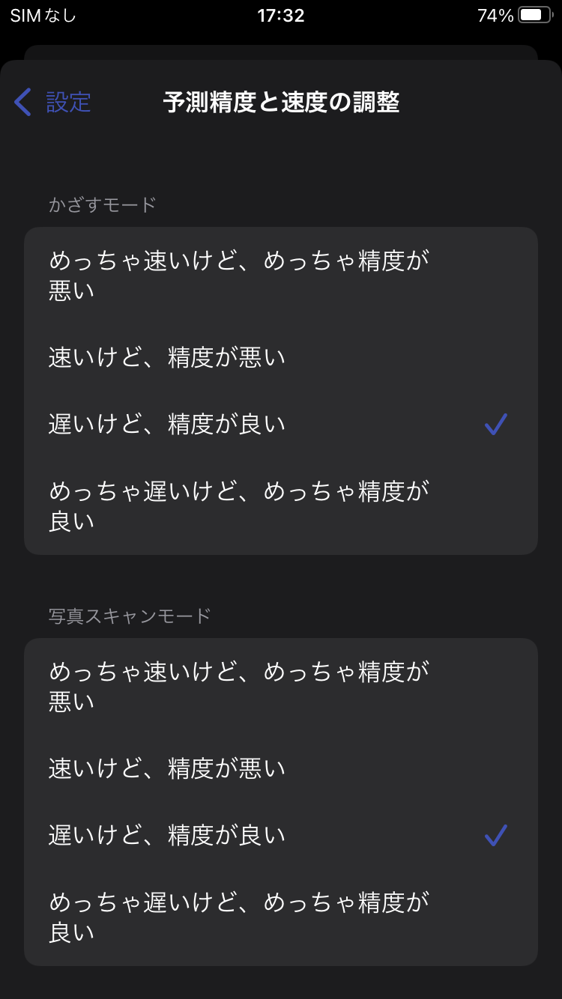

<style>
    .image-container {
        display: flex;
        align-items: baseline;
    }
    .image-div {
        width: 200px;
        padding: 0 10px 0 0;
    }
    .image-div > span {
        max-width: 100% !important;
    }
    .fixed-image img {
        width: 60% !important;
        height: auto !important;
        position: relative !important;
    }
    .fixed-image .gatsby-resp-image-background-image {
        display: none !important;
    }
    .badge-container {
        display: flex;
        align-items: center;
    }
    .badge-div {
        width: 250px;
        height: 83px;
        margin-bottom: 20px;
    }
</style>

## これは何

スマホをかざすと、AIがリアルタイムに物体検出を行い抵抗値を判別してくれる抵抗値AI計算機というアプリを作成しました。

<div class="image-div">
    
</div>

<div class="badge-container">
    <div class="badge-div">
        <a href='https://play.google.com/store/apps/details?id=com.takigawamemo.resistorai&pcampaignid=pcampaignidMKT-Other-global-all-co-prtnr-py-PartBadge-Mar2515-1'></a>
    </div>
    <div>
        <a href="https://apps.apple.com/us/app/resistor-ai-calculator/id1587462977?itsct=apps_box_badge&amp;itscg=30200" style="display: inline-block; overflow: hidden; border-radius: 13px; width: 250px; height: 83px;"></a>
    </div>
</div>

### Androidデモ

<iframe width="560" height="315" src="https://www.youtube.com/embed/53GfHl6Ofq0" title="YouTube video player" frameborder="0" allow="accelerometer; autoplay; clipboard-write; encrypted-media; gyroscope; picture-in-picture" allowfullscreen></iframe>

<br />
<br />

<div class="image-container">
    <div class="image-div">
        
    </div>
    <div class="image-div">
        
    </div>
    <div class="image-div">
        
    </div>
</div>

### iOSデモ

<iframe width="560" height="315" src="https://www.youtube.com/embed/sUAS1hc6M7E" title="YouTube video player" frameborder="0" allow="accelerometer; autoplay; clipboard-write; encrypted-media; gyroscope; picture-in-picture" allowfullscreen></iframe>

<br />
<br />

<div class="image-container">
    <div class="image-div">
        
    </div>
    <div class="image-div">
        
    </div>
    <div class="image-div">
        
    </div>
</div>

今回はアプリ作成にあたり行った、データの収集、モデルの設計、PyTorchを用いたモデルの学習、学習したモデルの量子化やTorchScriptへの変換、モバイルデバイスへのデプロイ等について簡単にまとめていきたいと思います。  
何か勘違いしている点、至らない点等ありましたらご指摘頂けると幸いです。

## 自己紹介

精密工学という分野を専攻している学生です。  
主に、センサやアクチュエータ、制御工学、様々な加工や計測方法、材料工学、画像処理、CAD、設計ライフサイクルマネジメントなどを勉強しています。  
また、アルバイトでAndroidやiOS等のスマホアプリ開発に従事しています。  
どちらかというとAndroidよりの人間で、Android : iOS = 7 : 3 くらいの感じです。

## アプリの説明

最近(といっても2ヵ月以上前ですが)、実験や演習でセンサから取得した信号からノイズやオフセットを取り除くフィルター回路を作成したり、取得した信号に対して何かしらの簡単な制御系を設計してそれをモーターにフィードバックしたりということをする機会がよくありました。

フィルター回路や制御系を設計する際には、マイコン上でC言語で書いたプログラムを走らせたり、ブレッドボードに抵抗やコンデンサ、オペアンプなどをぷすぷす差し込んで要求を満たす回路を作成したりします。

例えば、下画像は、mbedというマイコンと、LED、フォトダイオード、抵抗、コンデンサ、オペアンプなどを用いて作成した脈波を計測するシステムです。

<div class="fixed-image">
    
</div>

少し見づらいですが、ブレッドボードの下部にLEDとフォトダイオードが配置されており、その間に指を差し込んで脈波を計測します。

指の動脈が収縮すると、LED光の伝播経路に差が生じて光の透過率が変化し、フォトダイオードで計測される光の強度が変化するため、脈波を信号として抽出することが出来るという仕組みらしいです。

ただし、単純にフォトダイオードの信号をマイコンで読み取っても、明確な脈波形状を抽出することは出来ません。  
フォトダイオードの信号に乗っかっているノイズを取り除いたり、またフォトダイオードには光の強度に対して出力が線形に出てくる領域と非線形に出てくる領域があるので出力が線形になるように電圧降下をかけてあげたり、それをマイコンが読み取れる電圧の大きさにリスケールしたりという調整が必要になってきます。

うまいこと調整するためには、適切な抵抗値の抵抗、適切な電気容量のコンデンサを選択して回路を設計する必要があります。

上画像において、茶色の電子回路部品が抵抗、緑色の電子回路部品がコンデンサです。  
抵抗には色のついた線が印刷されていますが、これは抵抗のカラーコードと呼ばれるもので、抵抗の抵抗値はこのカラーコードの色のパターンから計算できます。  
橙橙黒金は33Ω、緑茶黄金は510KΩ、青赤緑金茶は6.2MΩといった感じです。

[抵抗のカラーコード](https://www.jarl.org/Japanese/7_Technical/lib1/teikou.htm)

さて、回路を作成していく上で、欲しい抵抗値の抵抗が常に手元にあれば良いのですが、そうでない場合は、複数の抵抗を並列や直列につなぎ合わせて欲しい抵抗値に近い等価の回路で代用したりします。

そうして、トライアンドエラーを繰り返しながら回路を設計していき、良さげな出力が得られた頃に、回路を見直してみると、「いや、ここの回路の抵抗値って結局いくつやねん！」ってなったりします。(ちゃんといちいち回路図を書いていればそうはならないのですが...)。

色と数字の対応を覚えればいいのですが、なんとなく覚える気にならず、そんな時にスマホをかざすと自動で抵抗値を判別してくれるアプリがあれば便利かなと思ったのと、個人で何かしらのアプリをリリースしたかった、機械学習を勉強し始めたので何かしらのモデルをモバイルデバイス上で動かしてみたかったなどの理由から、アプリの制作に至りました。

## データの収集

実は、抵抗にも色々と種類があり、ネットで検索すると炭素被膜抵抗やら金属被膜抵抗やらその他にも色々な種類の抵抗が存在していることが分かります。

残念なこと？に、それらの抵抗器はそれぞれ形状や色が異なり、さらには抵抗値の表され方も、4本のカラーコードで表現されていたり、5本のカーラーコードで表現されていたり、まちまちです。

それらの抵抗を全て正しく識別し、抵抗値を計算することは、かなり難しいタスクであり、また、学習に必要な十分なデータを収集することも厳しいと思われます。

個人的によく目にする抵抗は、炭素被膜抵抗で抵抗値が4本のカラーコードで表されているものであり、学科の先生にお聞きしたところ、分野によって違う可能性はあるが、それが割とメジャーっぽいとのことだったので、今回の学習や予測の対象とする抵抗は炭素被膜抵抗で抵抗値が4本のカラーコードで表現されているものに絞ることにしました。

抵抗値が4本のカラーコードで表現されいる場合、1本目は10桁目の数字、2本目は1桁目の数字、3本目は指数、4本目は誤差にそれぞれ対応しています。

このうち十分な画像データを収集出来なかった、4本目の誤差に対応する色が金色(±5%)以外の抵抗や、3本目の指数部分が銀色(10^-2)の抵抗もさらに予測対象から除外することにしました。

まとめると、今回のアプリで識別可能な抵抗は、炭素被膜抵抗で抵抗値が4本のカラーコードで表現されており、4本目の誤差に対応する色は金色、3本目の指数に対応する色は銀色以外という条件に当てはまるもの(10x10x11=1100種類)となります。

ここまで対象を絞り込めば、自分の機械学習の知識の範囲内でもなんとか手に負えそうな気がしてきます。

学習に用いる画像データは、自宅にあったものや、学科の先生に許可を貰って、研究室にある抵抗の写真をひたすらぱしゃぱしゃ撮影させて頂きました。

<div class="image-container">
    <div class="image-div">
        
    </div>
    <div class="image-div">
        
    </div>
    <div class="image-div">
        
    </div>
</div>

最終的に34パターンの抵抗について1400枚程度の画像を収集することが出来ましたが、それでも予測対象の抵抗は全部で1100パターンもあり、到底足りていないです。

ということで、データ水増しとして、収集できなかったカラーパターンを作成するために、別の抵抗から色だけ抽出して塗り絵的に貼り付けるということをしました。  
以下、色の切り取りによって人工的に生成した画像を添付します。

<div class="image-container">
    <div class="image-div">
        
    </div>
    <div class="image-div">
        
    </div>
    <div class="image-div">
        
    </div>
</div>

この人工的に生成した画像がどれだけ実際の画像に対応できるか甚だ疑問ですが、まあ無いよりかはマシなのかなという気がしないでもないです...。
人工的な画像は、全てのカラーパターンについて1個ずつ作成しました。

ちなみにアノテーションの作成には[coco-annotator](https://github.com/jsbroks/coco-annotator)というツールを利用しました。

## モデルの設計

torchvisionパッケージにある、fasterrcnn\_mobilenet\_v3\_large\_fpnモデルをベースに作成しました。  
one-stage系の物体検出モデルとして、EfficientDet-d0なども試してみたところ、自分の経験不足でパラメータ等の設定を間違えていた可能性は否めませんが、FasterRCNNと比較するとあまり精度が出ませんでした。

単純にtorchvisionパッケージにあるMobileNetV3-largeバックボーンのFPNありFasterRCNNをそのままクラスラベル数を1100にして学習したわけでわなく、いくつか変更を加えています。

torchvisonのデフォルトのモデルと変更後のモデルの概略図は以下の通りです。

<div style="text-align: center;">
元々のfasterrcnnモデル
</div>


<div style="text-align: center;">
変更後のfasterrcnnモデル
</div>


<br />

主な変更点は以下の通りです。

1. 元々のfasterrcnnでは全ての全てのスケールのoutputに対して、同じサイズのアンカーボックスを割り当てていたが、変更後はスケールに応じて割り当てるアンカーボックスのサイズを変更した。

2. 元々91個のclass logitを出力していた全結合層の出力は33個にした。最初の2つの出力がbackgroundかforegroundかを出力、次の10個の出力が1本目の色のlogit、次の10個の出力が2本目の色のlogit、最後の11個の出力が3本目の色のlogitに対応する。

3. 元々のモデルではクラスごとに別々のbox regressionが割り当てられていたが、修正後は1つのbox regressionのみを使うようにした。

## モデルの学習

学習環境はGoogle Colaboratoryを利用しました。  
MobileNetV3-largeはCOCOデータセットで学習済みのものを使っています。  
epoch数は150、最初の1epochはwarm up、スタート時学習率は1e-4で、100、120、140epoch目にそれぞれ学習率を0.5倍しました。  
また、data augmentationはAlbumentationsというライブラリを利用しました。

## モデルの量子化とTorchScriptへの変換

PyTorchはモデルの量子化として、Post Training Dynamic QuantizationやPost Training Static Quantization、Quantization Aware Trainingといった方法をサポートしているようです。

今回はこの中でざっと見た感じ一番お手軽そうだったPost Training Dynamic Quantizationという方法を使った量子化を行いました。

Post Training Dynamic Quantizationによるモデルの量子化を行う場合は、以下のように学習済みのモデルをquantize_dynamic関数に渡すだけで、量子化済みのモデルが手に入ります。

```python
quantization_model = torch.quantization.quantize_dynamic(model,
                                                         {torch.nn.Linear},
                                                         dtype=torch.qint8)
quantization_scripted_model = torch.jit.script(quantization_model)
```

簡単ですね。モデルの量子化によって元々79MBあったモデルのサイズを38MBまで減らすことが出来ました。

なお、現在Post Training Dynamic Quantizationをサポートしているレイヤーはnn.Linearとnn.LSTMだけだそうです。それ以外の、nn.Cnv2dなどについては、Static QuantizationやQuantization Aware Trainingといった方法を使う必要があります。また機会があれば他の二つの方法についてもちゃんと勉強したいと思います。

モデルのTorchScriptへの変換についてですが、github上で公開されているモデルをそのままTorchScriptに変換しようとしてもエラーが出て上手くいかないことがよくありました。

以下、自分が比較的よく遭遇したエラーとその解決方法をまとめます。

１. 型推論が上手く出来ていない

モデルをTorchScriptに変換する際、明示的に型が指定されてい無い場合は、その引数の型や戻り値の型はtorch.Tensor型であると推論されることが多いみたいです。  
torch.Tensor型以外の引数や戻り値に関しては、ちゃんと型ヒントを付けて上げることによって、TorchScriptへ変換出来るようになります。

```python
# 型が情報が無いとtorch.Tensor型とみなされてしまうことがあるので
-   def encode(self, bboxes_in, labels_in, criteria = 0.5):

# 型ヒントを付加する
+   def encode(self, bboxes_in, labels_in, criteria: float = 0.5):
```

２. ModuleList周りのエラー

次によく遭遇したのが、ModuleList周りのエラーです。ModuleListにアクセスする時に、index、slice、enumerated、zipなどやり方でアクセスしていると、TorchScriptに変換する際にエラーになります。for文を使うやり方であれば問題なく変換してくれるので、ModuleListに触るときはfor文を使うようにします。

```python
# indexでアクセス出来ないので
- module = moduleList1[3]
- x = module(x)

# for文を使う。ちなみにforブロック内ではbreakもcontinueも使えない。
+ idx = 3
+ count = 0
+ for module in moduleList1:
+     if count == idx:
+         x = module(x)
+     count += 1


# zipも使えないので
- for module1, module2 in zip(moduleList1, moduleList2):
-     x = module1(x)
-     x = module2(x)

# for文を使う
+ moduleNum = len(moduleList1)
+ for i in range(moduleNum):
+     count = 0
+     for module1 in moduleList1:
+         if count == i:
+             x = module1(x)
+         count += 1
+     count = 0
+     for module2 in moduleList2:
+         if count == i:
+             x = module2(x)
+         count += 1
```

若干気持ち悪いですが、torchvisionの公式リポジトリでもこのような書き方がされている箇所([feature\_pyramid\_network.py](https://github.com/pytorch/vision/blob/main/torchvision/ops/feature_pyramid_network.py))があったので、今のところこれ以外の方法は無さそうです。

## モバイルアプリの構成

基本的な画面構成は以下の通りです。

１. ホーム画面

<div class="image-container">
    <div class="image-div">
        
    </div>
    <div class="image-div">
        
    </div>
</div>

２. ライブ画面

カメラから取得した映像に対して、リアルタイムに物体検出を行います。
画面下部のキャプチャボタンをタップすると、画像をキャプチャし、画像解析画面に移ります。

<div class="image-container">
    <div class="image-div">
        
    </div>
    <div class="image-div">
        
    </div>
</div>

<br />

３. 画像解析画面

フォトライブラリで選択した画像や、ライブ画面でキャプチャした画像に対して物体検出を行います。
画面下部にある編集ボタンをタップすると編集画面に移行し、削除ボタンをタップすると誤認識したバウンディングボックスを削除、追加ボタンをタップすると新しくバウンディングボックスを追加できます。

<div class="image-container">
    <div class="image-div">
        
    </div>
    <div class="image-div">
        
    </div>
</div>

<br />

４. 編集画面

編集画面では個々の予測ボックスに対して予測リストの確認や手動での予測ラベルの修正を行うことが出来ます。  
ここで、予測リストとして表示されているもについてですが、通常non maximum suppressionを行う際にclass scoreが小さかったものはoutputから除外されてしまいますが、今回のモデルではclass scoreが小さかったものについては、被ったバウンディングボックスへclass labelとclass scoreを追加するということをしています。  
従って、予測リストには複数のRegion Proposal由来のものが混ざっており、スコアを全て足し合わせると100%を超えてしまうことがあります。  
こういうやり方が正しいのかどうかは正直分かっていないのですが、仮に予測を間違えていたとしても予測リストの中に正しいものがあればそれをタップするだけで手動でカラーコードを指定せずに修正出来るので、使いやすさという観点からすれば問題ないのかなと考えています。

<div class="image-container">
    <div class="image-div">
        
    </div>
    <div class="image-div">
        
    </div>
</div>

<br />

カラーコードタブを選択すると、手動で予測を修正することができます。

<br />

<div class="image-container">
    <div class="image-div">
        
    </div>
    <div class="image-div">
        
    </div>
</div>

<br />

５. 設定画面

<div class="image-container">
    <div class="image-div">
        
    </div>
    <div class="image-div">
        
    </div>
</div>

<br />

<div class="image-container">
    <div class="image-div">
        
    </div>
    <div class="image-div">
        
    </div>
</div>

<br />

予測精度と速度の調整という項目から、スマホをかざしている時と画像解析している時の予測精度と速度を調整することが出来ます。    
これは何なのかというと、ここで指定したオプションに基づいてネットワークに投入する画像のresolutionが決定し、画像サイズが大きいほど精度は上がるが速度は遅くなる的な調整が出来るようになっています。

- めっちゃ速いけど、めっちゃ精度が悪い ... (minSize, maxSize) = (360, 480)
- 速いけど、精度が悪い ... (minSize, maxSize) = (720, 960)
- 遅いけど、精度が良い ... (minSize, maxSize) = (1200, 1600)
- めっちゃ遅いけど、めっちゃ精度が良い ... (minSize, maxSize) = (1680, 2240)

ネットワークに投入される画像のresolutionは上のminSizeとmaxSizeを元に計算されます。

1. 画像の小さい方の1辺がminSizeになるようにリスケール。
2. リスケールした画像の大きい方の1辺がmaxSizeを超えていた場合、大きい方の辺がmaxSizeになるようにさらにリスケール。

minSizeとmaxSizeからresolutionを決めるやり方はtorchvisionにあったものを参考にしました。

### Android

使用した主なライブラリ

- Koin ... DIコンテナ。  
    特にDagger+HiltよりもKoinが好きというわけではなく、自分があまりDagger+Hiltに触ったことがなく、なるべく開発工数を減らしたかったので、テスト時のモック周りの勝手も知れているKoinを利用することにしました。(といってもちゃんとしたテストが書けるわけではないですが)
- PyTorch Mobile ... 推論。
- [gesture-views](https://github.com/alexvasilkov/GestureViews) ... ImageViewやViewのスワイプ、ピンチを良しなにやってくれる。  
    iOSの場合、UIScrollViewとUIImageViewを入れ子にすれば簡単お手軽にスワイプ、ピンチ機能つきimageビューアを作成することができるのですが、Androidの場合、公式のライブラリのみで同じことをやろうとすると結構大変です。こちらのgesture-viewsというライブラリを使用すれば、そういった画像ビューアを簡単に作成出来るほか、複数のViewに対して一緒にスワイプ、ピンチするといったことも可能になっています。
- [android-image-cropper](https://github.com/ArthurHub/Android-Image-Cropper) ... 画像の切り取り。  
    予測ボックスを追加する画面で使用しました。
- Firebase ... analyticsとかcrashlogとか。
- Leakcanary ... メモリリーク検出。
- AdMob ... 広告。

### iOS

自分はどちらかというとAndroidよりの人間なので、iOSでもMaterial Designを使って開発が出来ると幸せです。  
そこで、material-components-iosのgithubレポジトリを見に行ってみると以下の文言が。

> Material's iOS libraries are in maintenance mode as of July 15, 2021

今後、iOSでMaterial Designに則ったアプリを開発したければFlutterを使えとのことでした。  
ということで、今回のアプリでは大人しくUIKitの標準的なUIのみを使って作成しています。  
機会があればFlutterも一度ちゃんと触ってみたいです。   

使用した主なライブラリ

- [Swinject](https://github.com/Swinject/Swinject) ... DIコンテナ。  
    Androidアプリだと、Dagger+Hiltという公式ライブラリのおかげもあってか、割と小さな規模のサンプルアプリでもDIライブラリが使われていたりするのですが、iOSアプリの場合はAndroidに比べてそこまでDIライブラリが使われていないという印象を個人的には持っています。今回のような規模のアプリに本当にDIライブラリが必要かどうかと聞かれると、確かに疑問ですが、使っていて困るものでもないのでiOSのDIライブラリの中で一番人気のありそうなSwinjectというライブラリを使用しました。
- PyTorch Mobile ... 推論。
- [R.swift](https://github.com/mac-cain13/R.swift) ... AndroidのR.hoge.hogeみたいな感じでリソースファイルにアクセス出来るようにするライブラリ。
- [LicensePlist](https://github.com/mono0926/LicensePlist) ... オープンソースライセンス表示。
- [TOCropViewController](https://github.com/TimOliver/TOCropViewController) ... 画像の切り取り。  
    予測ボックスを追加する画面で使用しました。
- Firebase .. analyticsとかcrashlogとか。
- AdMob ... 広告。

## まとめと今後について

実はデモ動画で使用した抵抗は全て画像データが収集出来たものを使っており、それらの抵抗については動画を見ても分かる通りほぼ間違えずに予測出来ているのですが、画像データを収集出来ず人工的な色の切り貼りによってごまかしたパターンの抵抗についての予測精度は正直期待していたレベルとは程遠く、正しい抵抗値が予測リストの中にさえ含まれていないということも結構あります。  
使ってみた率直な感想としては、抵抗値を自動で判別してくれるアプリというより、画像内の抵抗に簡単にアノテーションを付けられるアプリみたいになってしまったのが、非常に残念でした。  
今後はもし気力があれば、オプトインで同意を得られた場合に画像を収集出来るような機能を追加したり、単純な色の切り貼りではなく他のもっと良いデータの水増し方法の調査を進めたり、推論部分について現在はPyTorch Mobileを使ってCPU上で動かしているのをTensorflow Liteを使ってGPU上で動くようにTensorflowで学習し直したりといったことを進めていきたいと考えています。  
また、しばらくはkaggleやsignoteにもちゃんと出て、機械学習関連のもう少しまともな知識やスキルを身に付けられるようにしていきたいです。


## 参考リンク

- [抵抗のカラーコード](https://www.jarl.org/Japanese/7_Technical/lib1/teikou.htm)

- [jsbroks/coco-annotator: :pencil2: Web-based image segmentation tool for object detection, localization, and keypoints](https://github.com/jsbroks/coco-annotator)
